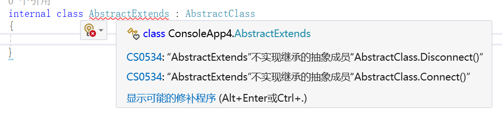

# day13

## 上节回顾

#### 回调函数

> 假设 函数F,  将函数F作为函数A的参数传递给函数A内部，并且函数A内通过形参的形式调用了，我们将函数F称为回调函数
>
> > 函数可以作为参数使用

- 回调函数的使用场景： 封装 循环逻辑中变化条件的操作

```C#
Linst<int>> Filter(list,Func<int,bool> fn){
    List<int> newList = new();
    foreach(var item in list){
        if(fn(item)) newList.Add(item)        
    }         
    return newList
}


Filter(ls，(val)=>{
    retrun val>0;
})
```


#### 面向对象

> 将现实世界的事物抽象为 类 和 对象，通过 封装、继承 和多态 书写代码，更好的维护代码

```C#
修饰符 class 类名 { //类名也是一个类型
    // 访问器设置器决定了 该属性的操作权限
    修饰符 类型 属性名{get;set;}
    修饰符 返回值类型 方法名(){
        
    }
}

类名 变量 = new 类名();
```

#### 访问修饰符

- public: 公共的；所有地方都可以使用
- protected： 受保护的，类内部可以使用，外部不能使用，子类可以使用
- private： 私有的，类内部可以使用，外部不能使用，子类不可以使用
- internal： 项目内部的，当前项目可以访问，其他项目不可以访问
- static： 静态的， 修饰的属性方法 是属于 类的； 实例对象不能使用

#### 构造函数

> 在类中， 和类名同名的方法 且没有返回值 就是构造函数； 根据构造函数的修饰符，分为三种构造函数

- **实例构造函数**

  - 每次实例化对象的时候，系统都会自动执行实例构造函数

  ```C#
  public class A{
      public string X{get;set;}；
      public string Y{get;}；
      public A(string x,string y){
          X = x；
          Y = y；
      }    
  }
  
  new A(10,20)；
  ```

  > 实例构造函数一般都是用于 给实例属性初始化值的

- 静态构造函数

  - 静态构造函数 和 实例构造函数 可以一起书写
  - 第一次实例化对象的时候， 会先执行静态构造函数，后续多次实例化不会再静态构造函数

     ```C#
     public class A{
      public string X{get;set;}；
      public string Y{get;}；
      static int Z{get;}；
      public A(string x,string y){
          X = x；
          Y = y；
      }
      static A(){
          Z = 999;
      }    
     }
     ```

  new A(10,20)；
  new A(20,30)；
     ```
  
  > 静态构造函数一般都是在初次实例化的 给静态属性初始化值的
     ```

- 私有构造函数

  - 构造函数私有化， 则外部不能执行new 类 ===> 不能实例化对象
  - 一般私有构造函数用于 实现类的单例模式（一个类使用过程中，只有一个实例对象）， 可以节省了内存

  ```C#
  public class A{
      public void cal(){}
      public void sum(){}
  
      private string intstance{get;set;}；
      private A(){}
      static public A GetInstance(){
          if(instance == null){
              instance = new A();
          }
          return instance;
      }    
  }
  A Aobj1 = A.GertInstance()
  Aobj1.cal();
  /************************/
  A Aobj2= A.GertInstance()
  Aobj2.sum()
  
  ```

#### 继承

> 让子类 天生具备 父类的 属性和方法  的操作 就是继承

```C#
public 子类:父类{
    
    
}
```

#### 多态

**表现形式1：**

- 子类继承父类， 可以重写父类中的方法，调用方法会执行子类的重写方法
  - 父类使用virtual修饰的方法才可以重写，子类必须使用 override修饰重写的方法

**表现形式2：**

- 通过一个函数调用，根据传递的参数不同，执行的效果不一样
  - 类中的同一个方法名可以书写多个方法，只要参数不一样就行


## 一、抽象类

### 1、概念

抽象类也是一种类，用于提取多个类的公共属性和方法，这个作用跟父类是一样的。抽象类跟父类不一样的地方在于：父类可以被实例化，抽象类不可以；父类中的方法都是定义好的，抽象类中的方法可以只定义方法名称和参数以及返回值，不实现具体功能。

简单来说，抽象类存在的目的就是被继承。而普通父类可以被继承，也可以实例化。

### 2、语法

抽象类使用abstract修饰，方法也可以用abstract修饰为抽象方法。

子类继承抽象类后，必须使用override实现抽象类中所有的抽象方法，除非子类也是抽象列。

例：

```c#
// 抽象类
internal abstract class AbstractClass
{
    //公共属性，所有设备共用
    public string DeviceName { get; set; }
    public bool IsConnected { get; set; }

    //抽象方法：没有方法体！强制子类一定要实现
    public abstract void Connect();
    public abstract void Disconnect();

    //抽象类也可以拥有普通方法，公共逻辑直接复用
    public void PrintName()
    {
        Console.WriteLine($"设备名称：{DeviceName}");
    }
}

// 在Main入口方法中使用
AbstractClass Class1 = new AbstractClass(); // 飘红报错，表示抽象类不能被实例化
```

子类定义好后：



所以子类必须实现其中的抽象方法，才能不报错：

```c#
internal class AbstractExtends : AbstractClass
{
    public override void Connect()
    {
        
    }
    public override void Disconnect()
    {
        
    }
}
```

如果子类也是抽象类，就可以选择性的实现或不实现抽象方法：

```c#
internal abstract class AbstractSon:AbstractClass
{
    public void Connect()
    {
        // 实现也可以，不实现也不报错
    }
}
```

### 3、作用

- 提取多个子类重复的公共代码，实现代码复用

  场景：

  ​	交通工具（汽车、飞机、轮船）

   	汽车、飞机、轮船都有属性：名称、最大速度；

  ​	都有共同行为：显示基础信息。

  如果不用抽象类：汽车、飞机、轮船各自重复写名称、速度、打印信息，大量重复代码。

  所以可以使用抽象类提取公共代码

  ```c#
  //抽象父类：交通工具
  abstract class Transport
  {
      //公共属性，所有子类共用
      public string Name { get; set; }
      public int MaxSpeed { get; set; }
  
      //普通方法，所有交通工具通用，子类直接继承，不用重复写
      public void ShowBaseInfo()
      {
          Console.WriteLine($"交通工具：{Name}，最高速度：{MaxSpeed}");
      }
  }
  
  //子类
  class Car : Transport { }
  class Plane : Transport { }
  ```

  这个交通工具类不应该被实例化，因为实例化出来后，我们不明白具体是什么交通工具，是汽车、还是轮船。

  

- 定义规范（抽象方法），强制子类必须实现某些功能

  例：所有交通工具都必须有启动功能，但是汽车启动、飞机启动、轮船启动逻辑完全不一样。

  父类没办法写统一实现，所以定义抽象方法，强制子类重写，不写编译报错！

  ```c#
  abstract class Transport
  {
      public string Name { get; set; }
      public int MaxSpeed { get; set; }
      public void ShowBaseInfo()
      {
          Console.WriteLine($"交通工具：{Name}，最高速度：{MaxSpeed}");
      }
  
      //抽象方法：没有方法体！强制子类必须实现Start()
      public abstract void Start();
  }
  
  class Car : Transport
  {
      //必须实现Start，否则代码报错
      public override void Start()
      {
          Console.WriteLine("汽车点火启动");
      }
  }
  
  class Plane : Transport
  {
      public override void Start()
      {
          Console.WriteLine("飞机引擎启动");
      }
  }
  ```

  抽象方法 = 定下规矩：凡是交通工具，一定要能启动。团队开发时，避免有人新建子类忘记写核心方法。

- 搭建继承体系，统一父类类型，支撑多态

  我们有统一抽象父类 `Transport`，就可以用父类类型接收所有子类对象，实现多态。

  ```c#
  //多态方法，接收任意交通工具
  static void RunTransport(Transport t)
  {
      t.ShowBaseInfo();
      t.Start(); //自动执行对应子类的Start方法
  }
  
  //调用   new Car() 得到的实例对象的类型 即可以是Car的也可以是父类的 Transport
  Transport car = new Car() { Name = "轿车", MaxSpeed = 180 };
  Transport plane = new Plane() { Name = "客机", MaxSpeed = 900 };
  
  RunTransport(car);
  RunTransport(plane);
  ```

  我们不需要关心传入的到底是汽车还是飞机，只要它属于交通工具。统一父类类型，实现通用逻辑，这就是多态的基础。抽象类不能实例化，刚好符合逻辑：世界上不存在 “单纯的交通工具”，只有具体汽车、飞机。


## 二、静态类

之前的类，都是为了实现项目的模块。但有些类，不是为了实现项目模块，而是给项目提供一些功能函数。例如我们之前学习的Math，只为了提供一些方法，实现功能，而不是实现项目的某个模块。

Math是一个类，其中的方法使用方式都是`Math.xxx`，我们发现这些方法都属于静态方法，这个类中没有非静态的成员，这种类我们叫做**静态类**。

静态类不能被实例化，不能被继承，里面所有的属性和方法都是静态的。只是单纯的作为多个工具方法的容器。

例：我们在项目中常用的工具方法可以集中在一起，放在静态类中封装

```c#
// 机器视觉通用工具【静态类】
static class VisionTool
{
    // 像素坐标转换成物理实际坐标（相机标定换算）
    // pixelValue：像素数值
    // scale：缩放比例 mm/像素
    // 返回值：实际物理长度(mm)
    public static double PixelToWorld(double pixelValue, double scale)
    {
        return pixelValue * scale;
    }

    // 计算两点之间像素距离
    public static double CalcPixelDistance(double x1, double y1, double x2, double y2)
    {
        double dx = x2 - x1;
        double dy = y2 - y1;
        return Math.Sqrt(dx * dx + dy * dy);
    }

    // 判断灰度值是否在阈值区间
    public static bool GrayInRange(int grayValue, int min, int max)
    {
        return grayValue >= min && grayValue <= max;
    }

    // 角度限制到 0~360 范围
    public static double NormalizeAngle(double angle)
    {
        angle %= 360;
        if (angle < 0)
            angle += 360;
        return angle;
    }
}
```

## 三、密封类

如果一个类不想被继承，就将这个类定义成一个密封类，用sealed关键字修饰。

例：

```c#
// 密封类，不能被继承
sealed class Person
{
    
}

// 飘红报错，无法继承密封类
class Student : Person
{

}
```

如果一个方法不想被子类重写，也可以用sealed修饰为密封方法。

```c#
class Animal
{
    public virtual void Speak()
    {
        
    }
}

class Dog : Animal
{
    // 密封方法：后续再继承Dog的类，不能重写Speak
    public sealed override void Speak()
    {
        Console.WriteLine("汪汪");
    }
}
// 飘红报错，无法重写Speak方法
class SmallDog : Dog
{
	public override void Speak(){}
}
```

注意：添加了sealed修饰符的方法，不能被子类重写的。sealed必须跟overried配合一起使用，不能跟virtual配合一起使用。

## 四、接口

### 1、概念

接口是一种更加抽象的概念，他的出现是为了制定行为标准，只说有什么能力，而不去具体实现。我们可以把接口理解为一份说明书，比如：拍照规范说明书，规定必须具备拍照功能，手机、相机、摄像头都必须遵循这份说明书，只是他们内部实现拍照功能的代码不一样。

对比类：

交通工具类和汽车类，汽车属于交通工具；

接口是可拍照，所有相机摄像头都具备可拍照的能力。

接口之定义规范，更偏向于告诉一些设备，你能做什么。类的话，更加偏向于这个能力是怎么实现的。

### 2、语法

接口使用interface关键字定义，接口中定义属性和方法（半成品），所有成员不用加访问修饰符，默认都是public。

```c#
interface 接口名称{
    类型 属性名称 {get; set;}
    返回值 方法名称(类型 参数); // 参数中可以有out
}

```

例：

```c#
interface IImageGrabber
{
    // 只定义方法签名，没有实现代码
    bool GrabImage(out byte[] imageData); // 采集图像，返回采集是否成功，抛出采集到的图像
    bool Connect(); // 连接
    void Disconnect(); // 断开连接
}

```

这个接口规定具备图像采集能力，要能采集图像，能连接，能断开，没有具体的实现。

定义类可以实现这个接口规定的具体功能，类实现接口跟继承的语法是一样的

```c#
// 海康相机，实现采集接口
class HikCamera : IImageGrabber
{
    public bool Connect()
    {
        Console.WriteLine("海康相机SDK连接");
        return true;
    }

    public void Disconnect()
    {
        Console.WriteLine("断开海康相机");
    }

    public bool GrabImage(out byte[] imageData)
    {
        Console.WriteLine("调用海康接口采集图像");
        imageData = new byte[1024]; // 定义了一个图像
        return true;
    }
}

// Basler相机，同样实现采集接口
class BaslerCamera : IImageGrabber
{
    public bool Connect()
    {
        Console.WriteLine("Basler相机SDK连接");
        return true;
    }

    public void Disconnect()
    {
        Console.WriteLine("断开Basler相机");
    }

    public bool GrabImage(out byte[] imageData)
    {
        Console.WriteLine("调用Basler接口采集图像");
        imageData = new byte[1024];
        return true;
    }
}
```

一个类可以实现多个接口：一台智能相机，既能采集图像，又能输出触发信号。可以实现两个接口：

```c#
interface IImageGrabber { ... }
interface ITriggerOutput
{
    void SendTrigger(); // 输出触发信号
}

// 同时实现两个接口
class SmartCamera : IImageGrabber, ITriggerOutput
{
    // 实现IImageGrabber所有方法
    // 实现ITriggerOutput所有方法
    public void SendTrigger()
    {
        Console.WriteLine("输出硬件触发信号");
    }
}
```

> 类只能继承一个父类，但是可以实现N 个接口。

接口最大的优点，就是用来实现多态。

例：我们先定义接口，说明可以支付这个能力，并需要传入支付多少金额：

```c#
interface IPay
{
    void Pay(double price);
}
```

我们在开发过程中，暂时只申请了支付宝和微信的支付，银行卡支付的申请没有下来，就先定义微信支付类和支付宝支付类，他们都按照接口规定，实现支付方法：

```c#
// 支付宝支付
class AliPay: IPay
{
	public void Pay(double price)
	{
		Console.WriteLine("支付宝支付" + price);
	}
}
// 微信支付
class WechatPay: IPay
{
	public void Pay(double price)
    {
    	Console.WriteLine("微信支付" + price);
    }
}
```

我们定义一个支付方法，用于实现支付功能：

```c#
static void Buy(IPay pay) // 接口作为类型
{
    pay.Pay(1000); // 调用接口的方法实现支付功能
}

```

当我们使用微信和支付包支付时，实例化微信支付类，用接口作为类型，传入这个方法：

```c#
IPay pay1 = new AliPay();
Buy(pay1);

IPay pay2 = new WechatPay();
Buy(pay2); 

```

后续银行卡支付的申请下来了，我们再扩展银行卡支付的功能，不用修改原有的代码，只需要再添加一个银行卡支付的类即可：

```c#
// 银行卡支付类
class BankCardPay: IPay
{
	public void Pay(double price)
    {
    	Console.WriteLine("银行卡支付" + price);
    }
}

IPay pay3 = new BankCardPay();
Buy(pay3);

```

## 五、this

如果在类的方法中，我们给属性进行赋值。当参数名称和属性名称同名时，我们混淆：

```c#
internal class ThisKeyword
{
    public string Name { get; set;  }
    public ThisKeyword(string Name)
    {
        Name = Name;
    }
}
ThisKeyword obj = new ThisKeyword("this is Name");
Console.WriteLine(obj.Name); // 输出为空
```

此时我们需要区分参数和属性，可以使用this关键字。

```c#
public ThisKeyword(string Name)
{
    this.Name = Name;
}
```

this只在类中可以使用，代表当前实例对象本身。所以上面代码中的this其实就代表new出来的obj。

this关键字的作用：

1. 类方法中区分属性和参数

2. 将当前实例对象传递给其他方法

   ```c#
   // 银行卡类
   class BankCard
   {
       public decimal Balance { get; set; }
   
       public void ShowInfo()
       {
           //把当前银行卡实例传给工具方法
           CardHelper.PrintInfo(this);
       }
   }
   // 银行卡帮助类
   static class CardHelper
   {
       public static void PrintInfo(BankCard card) // 输出银行卡余额
       {
           Console.WriteLine($"余额：{card.Balance}");
       }
   }
   ```

   

3. 多个构造函数时进行简写

   ```c#
   class BankCard
   {
       public string CardNo { get; set; }
       public string Owner { get; set; }
   
       //构造函数1
       public BankCard(string cardNo) : this(cardNo, "未知户主") // 调用下面的构造函数执行
       {
   		// 这里不用写具体代码了
       }
   
       //构造函数2
       public BankCard(string cardNo, string owner)
       {
           CardNo = cardNo;
           Owner = owner;
       }
   }
   
   ```

   解释：

   > **上面的this到底在干什么？**
   >
   > `this(xxx)` = 找自己类里面另外一个构造方法执行
   >
   > **为什么要有多个构造函数？**
   >
   > 假设场景：
   >
   > ​	场景 A：用户开户，同时提供【卡号 + 户主姓名】→ 两个参数
   >
   > ​	场景 B：系统自动生成临时银行卡，只知道卡号，户主暂时未知 → 只能传入卡号
   >
   > 如果只使用一个构造函数：
   >
   > ```c#
   > public BankCard(string cardNo, string owner)
   > {
   >    CardNo = cardNo;
   >    Owner = owner;
   > }
   > ```
   >
   > 当我们需要创建临时卡片，没有户主名字，调用的时候必须强制传一个字符串，每次都手动写`"未知户主"`
   >
   > ```c#
   > BankCard tempCard = new BankCard("6222xxx","未知户主");
   > ```
   >
   > 这样会导致项目里到处重复写 `"未知户主"`。万一以后需求改了，默认户主改成 `"匿名用户"`，整个项目所有地方全部要手动修改，容易漏改，产生 BUG。使用上面的this语法可以将匿名用户放在类中，这样在外部使用的时候不用手动添加这个参数了，将来需求改了，我们只需要修改类中的参数即可。

4. 声明索引器

   我们实例化出来的对象，默认是无法像数组或List或字典一样使用下标的。

   为了能让我们实例化出来的对象使用下标，就可以在类中定义索引器，定义索引器的语法是固定的：

   ```c#
   public 返回值 this[类型 索引类型] {
       get{
           return 值;
       }
       set{
           // 给某个数据赋值
           数据 = 值;
       }
   }
   ```

   例：

   ```c#
   public int this[int index]
   {
       get
       {
           return this.Age;
       }
       set
       {
           this.Age = value; // value在这里代表即将要赋的值
       }
   }
   
   ThisKeyword obj = new ThisKeyword("this is Name");
   obj[0] = 13;
   Console.WriteLine(obj[0]); // 13
   ```

注意：静态方法中不能用this。

## 六、访问器

我们在定义类中的属性时，可以不加 get 和 set，同样可以访问和赋值。那么添加 get 和 set 和意义在哪里？

我们可以在set中添加对数据赋值时的校验逻辑。例如：

不用set做校验时：

```c#
public string CardNo; // 银行卡号属性

// 外部代码，可以随便乱赋值，但银行卡号不能是空、不能长度不足，可我们无法去限制
card.CardNo = "";
card.CardNo = "123";
card.CardNo = null;
```

如果在赋值时对数据做校验，就会产生很多重复的代码。后期需要修改校验时，需要在项目中大量修改校验代码。所以使用set进行校验就是最好的解决方案：

```c#
private string _cardNo;
public string CardNo
{
    get => _cardNo;
    /*
    	get {return _cardNo}    
    */ 
    set
    {
        //赋值前做校验！
        if(string.IsNullOrEmpty(value) || value.Length < 10)
        {
            throw new Exception("卡号格式非法！");
        }
        _cardNo = value;
    }
}
```

如果一个属性是公开的，不加访问器，我们无法控制这个属性的可读可写权限，加上访问器就可以更加灵活的控制：

```c#
// 只读属性：外部不能赋值
public decimal Balance { get; private set; } // 银行卡余额
```

当外部读取属性值的时候，我们也可以利用get对数据做加工：

```c#
private decimal _money;
public string ShowMoney
{
    get
    {
        return $"余额：{_money} 元";
    }
}
```
